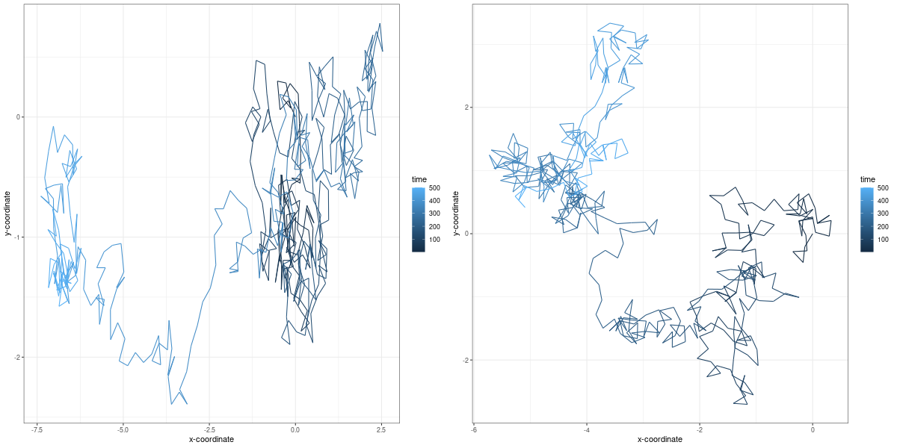
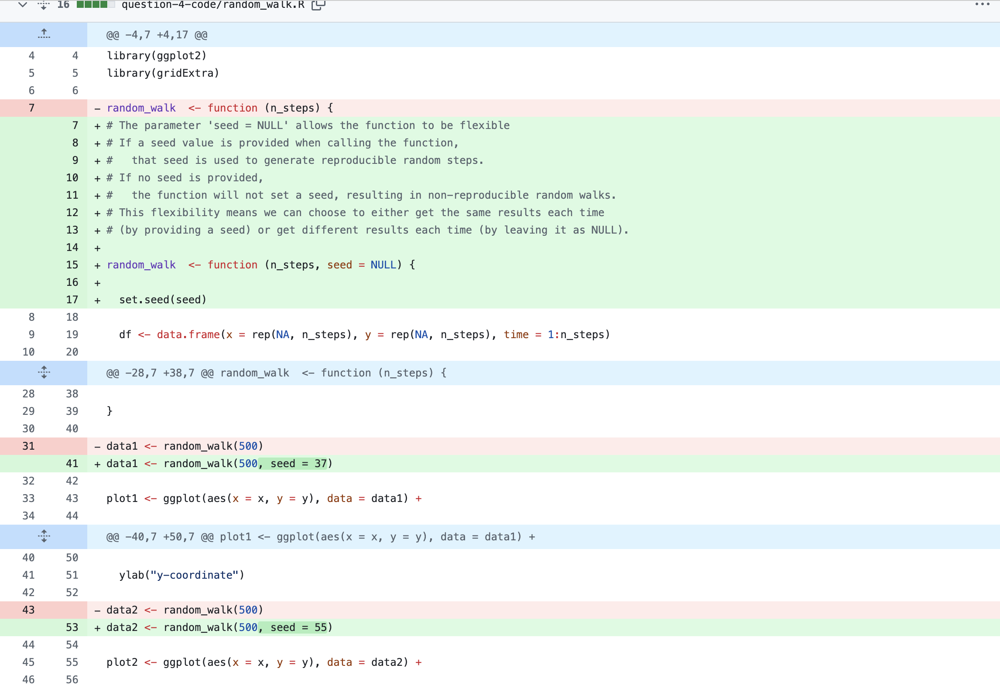
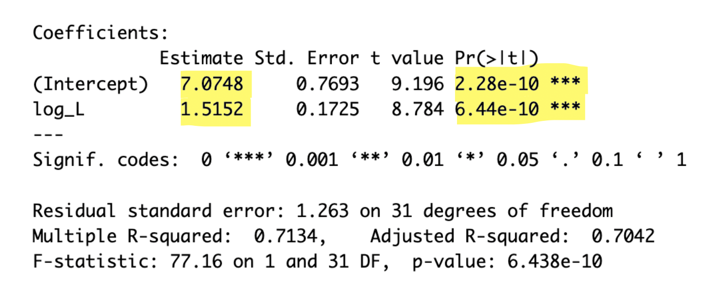

# Reproducible research: version control and R

Questions 1,2 and 3: <https://github.com/anon140103/logistic_growth>

### Question 4:

Sometimes we are interested in modelling a process that involves randomness. A good example is Brownian motion. We will explore how to simulate a random process in a way that it is reproducible:

**a) A script for simulating a random_walk is provided in the `question-4-code` folder of this repo. Execute the code to produce the paths of two random walks. What do you observe? (10 points)**



The provided script simulates the paths of two independent random walks on a 2D plane. Each walk begins at the origin (0,0) and moves through randomised steps. The colour gradient represents the progression of time. The darker shades of blue represent earlier steps in the walk and the lighter shades represent the later steps.

Every time I run the function, it generates a unique, unpredictable path because each step is determined randomly. The number specified within the function's brackets determines the length of the walk, this simulation ran for 500 units of time.

When comparing the two plots, there is a marked difference in the scale of the axes. Although not immediately obvious, the left-hand plot explores a greater range of x-axis values compared to the right-hand plot, while the right-hand plot explores a greater range of y-axis values compared to the left-hand plot. As a result, the left-hand plot shows more exploration of the horizontal 2D space, with more movement into both positive and negative x-axis values. In contrast, the right-hand plot shows more exploration of the vertical 2D space, with more movement into both positive and negative y-axis values.

These observations reveal the randomness of the process - each path evolves independently and unpredictably even when using the same parameters.

**b) Investigate the term random seeds. What is a random seed and how does it work? (5 points)**

A random seed is the initial input for a pseudorandom number generator. In R, when algorithms generate what appear to be "random" numbers, they are actually pseudorandom. This means that the sequence is not truly random, it is determined by the seed used to start the process. The sequence generated will be the same if the same seed is provided hence making the results reproducible. 

**c) Edit the script to make a reproducible simulation of Brownian motion. Commit the file and push it to your forked `reproducible-research_homework` repo. (10 points)**

**d) Go to your commit history and click on the latest commit. Show the edit you made to the code in the comparison view (add this image to the README.md of the fork). (5 points)**



Question 5:

(**30 points**) In 2014, Cui, Schlub and Holmes published an article in the *Journal of Virology* (doi: <https://doi.org/10.1128/jvi.00362-14>) showing that the size of viral particles, more specifically their volume, could be predicted from their genome size (length). They found that this relationship can be modelled using an allometric equation of the form **V=αLβ**, where V is the virion volume in nm^3^ and L is the genome length in nucleotides.

**a) Import the data for double-stranded DNA (dsDNA) viruses taken from the Supplementary Materials of the original paper into Posit Cloud (the csv file is in the `question-5-data` folder). How many rows and columns does the table have? (3 points)**

The data has 33 rows, and 13 columns.

**b) What transformation can you use to fit a linear model to the data? Apply the transformation. (3 points)**

To model the relationship between virion volume ($V$) and genome length ($L$), we can transform the allometric equation:

$$
V = \beta L^{\alpha}
$$

into its logarithmic form:

$$
\ln(V) = \ln(\beta) + \alpha \ln(L)
$$

This transformation allows us to fit a linear model of the form y=mx + c. Below is the R code used to transform the data and fit the model.

``` r
# Log-transform the data
log_viral_data <- viral_data %>%
  mutate(log_V = log(virion_volume_nm_nm_nm)) %>%
  mutate(log_L = log(genome_length_kb))

# Fit a linear model to the log-transformed data
model1 <- lm(log_V ~ log_L, log_viral_data)

summary(model1)
```

**c) Find the exponent (β) and scaling factor (α) of the allometric law for dsDNA viruses and write the p-values from the model you obtained, are they statistically significant? Compare the values you found to those shown in Table 2 of the paper, did you find the same values? (10 points)**



From the model summary output, we see:

-   $\alpha$ = 1.5152.
-   $\ln(\beta)$ = 7.0748, so $\beta = e^{7.0748} = 1181.8$.

These values are consistent with those reported in Table 2 of the original paper, where $\alpha = 1.52$ and $\beta = 1182$.

The p-value for $\alpha$ (log_L) is 6.44e-10, which is \<\<0.001 and statistically significant.

The intercept also shows a statistically significant p-value of 2.28e-10 which is \<\<0.001.

**d) Write the code to reproduce the figure shown below. (10 points)**

```{r}
# Create a plot of the log-transformed data with the fitted linear model
log_viral_data %>%
  ggplot(aes(x = log_L, y = log_V)) +
  geom_point() + 
  geom_smooth(method = "lm", linewidth = 0.8) +
  labs(x = "log[Genome length (kb)]", y = "log[Virion volume (nm³)]") +
  theme(axis.title = element_text(face = "bold")) +
  theme_bw()

```

**e) What is the estimated volume of a 300 kb dsDNA virus? (4 points)**

We have already have a fitted linear model for the data, which is defined as:

$$
\ln(V) = \ln(\beta) + \alpha \ln(L)
$$

If we substitute in our values from our linear model we get:

$$
\ln(V) = 7.0748 + 1.5152 \times \ln(L)
$$

Given this equation, we can estimate the volume ($V$) for a virus with a genome length ($L$) of 300 kb. To do this, we substitute 300 for $L$ in the equation:

1.  First, calculate $\log(300)$.
2.  Then, substitute this value into the equation to find $\log(V)$.
3.  Finally, exponentiate the result to get the volume $V$

I can do this using this code:

```{r}
# Define the coefficients from our linear model
intercept <- 7.0748
slope <- 1.5152        

# Define the genome length (L) in kb
L <- 300

# Calculate log(L)
log_L <- log(L)

# Use the model equation to caluclate log(V)
log_V <- intercept + slope * log_L

# Convert log(V) to V
V <- exp(log_V)

V
```

The estimated volume for a dsDNA virus with a genome length of 300kb is 6697007 nm³ = 6.70 x10^6^ nm³

Instructions

The homework for this Computer skills practical is divided into 5 questions for a total of 100 points. First, fork this repo and make sure your fork is made **Public** for marking. Answers should be added to the \# INSERT ANSWERS HERE \# section above in the **README.md** file of your forked repository.

Questions 1, 2 and 3 should be answered in the **README.md** file of the `logistic_growth` repo that you forked during the practical. To answer those questions here, simply include a link to your logistic_growth repo.

**Submission**: Please submit a single **PDF** file with your candidate number (and no other identifying information), and a link to your fork of the `reproducible-research_homework` repo with the completed answers (also make sure that your username has been anonymised). All answers should be on the `main` branch.

## Assignment questions

1)  (**10 points**) Annotate the **README.md** file in your `logistic_growth` repo with more detailed information about the analysis. Add a section on the results and include the estimates for $N_0$, $r$ and $K$ (mention which \*.csv file you used).

2)  (**10 points**) Use your estimates of $N_0$ and $r$ to calculate the population size at $t$ = 4980 min, assuming that the population grows exponentially. How does it compare to the population size predicted under logistic growth?

3)  (**20 points**) Add an R script to your repository that makes a graph comparing the exponential and logistic growth curves (using the same parameter estimates you found). Upload this graph to your repo and include it in the **README.md** file so it can be viewed in the repo homepage.

4)  (**30 points**) Sometimes we are interested in modelling a process that involves randomness. A good example is Brownian motion. We will explore how to simulate a random process in a way that it is reproducible:

    a)  A script for simulating a random_walk is provided in the `question-4-code` folder of this repo. Execute the code to produce the paths of two random walks. What do you observe? (10 points)\
    b)  Investigate the term **random seeds**. What is a random seed and how does it work? (5 points)\
    c)  Edit the script to make a reproducible simulation of Brownian motion. Commit the file and push it to your forked `reproducible-research_homework` repo. (10 points)\
    d)  Go to your commit history and click on the latest commit. Show the edit you made to the code in the comparison view (add this image to the **README.md** of the fork). (5 points)

5)  (**30 points**) In 2014, Cui, Schlub and Holmes published an article in the *Journal of Virology* (doi: <https://doi.org/10.1128/jvi.00362-14>) showing that the size of viral particles, more specifically their volume, could be predicted from their genome size (length). They found that this relationship can be modelled using an allometric equation of the form $`V = \alpha L^{\beta}`$, where $`V`$ is the virion volume in nm<sup>3</sup> and $`L`$ is the genome length in nucleotides.

    a)  Import the data for double-stranded DNA (dsDNA) viruses taken from the Supplementary Materials of the original paper into Posit Cloud (the csv file is in the `question-5-data` folder). How many rows and columns does the table have? (3 points)\
    b)  What transformation can you use to fit a linear model to the data? Apply the transformation. (3 points)\
    c)  Find the exponent ($\beta$) and scaling factor ($\alpha$) of the allometric law for dsDNA viruses and write the p-values from the model you obtained, are they statistically significant? Compare the values you found to those shown in **Table 2** of the paper, did you find the same values? (10 points)\
    d)  Write the code to reproduce the figure shown below. (10 points)

<p align="center">


</p>

e)  What is the estimated volume of a 300 kb dsDNA virus? (4 points)
